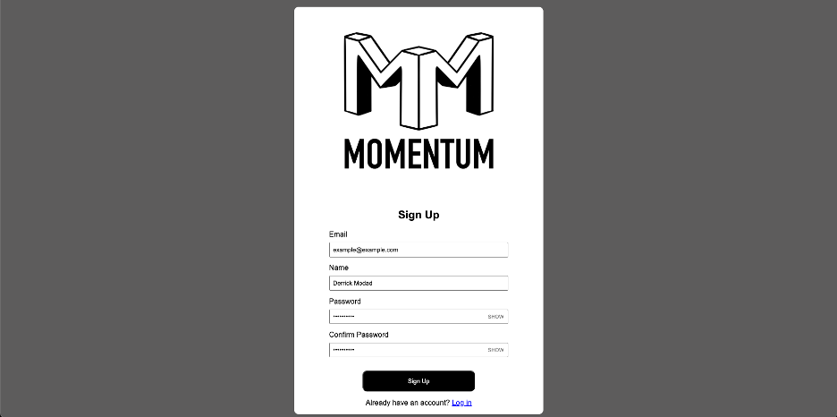

# Momentum
Momentum is a planner and calendar app that tracks the user’s day to day activities and travel patterns while also enabling the user to input custom events.

## Screenshots

### Sign Up Screen

### Dashboard View

### Add Event Pane

### Dashboard View with Items

